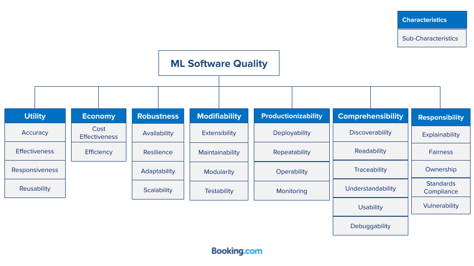

# A Software Quality Model for ML Systems

## Introduction
 
Defining and measuring quality of software is a challenging task traditionally addressed by 
the Software Engineering discipline by means of Software Quality Models.

A Software Quality Model represents and articulates all relevant aspects of a software system that constitute its 
quality. It enables organizations to turn the otherwise ambiguous concept of quality into a practical and actionable 
tool to construct better software.

## The ML Quality Model

Our Quality Model consists of a collection of characteristics we identified as fundamental for 
the overall quality of a Machine Learning System. Characteristics are rather abstract and hard to influence directly, 
therefore they are further decomposed into sub-characteristics. These sub-characteristics are concrete enough to be directly affected by 
specific software development practices. 

*A schematic representation the ML quality model acting as the backbone of quality improvement initiatives, ultimately
aiming at high quality ML systems.*

## Characteristic details 

Details of the characteristics mentioned in the diagram above [are available here](docs/characteristics.md)

## Sub-characteristic details 

Definitions of sub-characteristics [are available here](docs/definitions.md).

Details of the sub-characteristics [are available here](docs/subcharacteristics.md).

